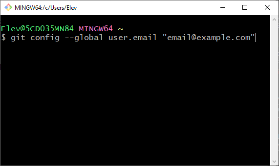
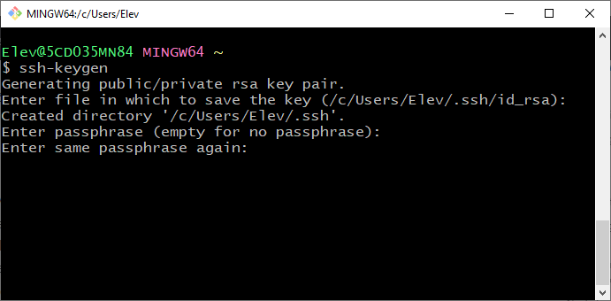
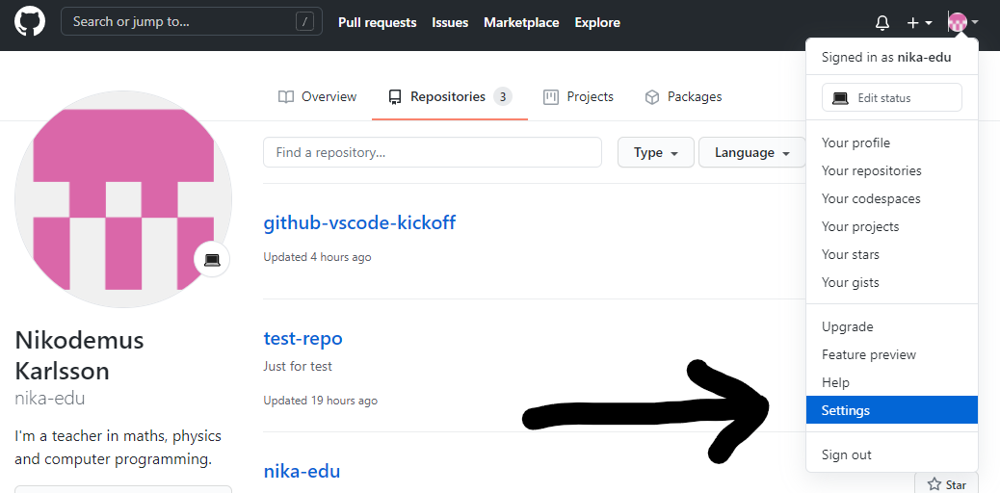
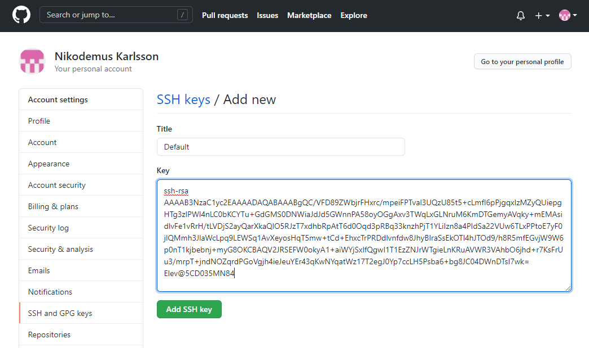

# Kom igång med i Github i VS Code
## Vad är GitHub?
GitHub är en s.k versionshanteringstjänst som många programmerare använder. Versionshantering innebär att tidigare versioner av källkod (eller andra dokument) sparas. All programutveckling sker stegvis; du kanske börjar med att skapa grundfunktionaliteten i programmet för att sedan bygga på med andra saker. I Github kan hela den processen sparas. Det gör att det går att gå tillbaka till en tidigare version om det skulle behövas. Du har dessutom alltid en backup på koden om din dator skulle gå sönder. Det är enkelt att dela kod med andra, och det går att samarbeta flera programmerare i ett och samma projekt (fast från olika datorer). Många projekt i GitHub är öppen källkod (Open Source), vars syfte är att skapa program som det är tillåtet för vem som helst att bygga vidare på. 

Syftet med den här guiden är att du ska skapa en miljö där du enkelt kan ladda upp och ladda ned kod till och från GitHub.

## Vad är VS Code?
VS Code, eller egentligen Visual Studio Code, är en editor. Det kan liknas vid t ex Microsoft Word eller Google Docs, men det är enbart text och inga formateringar på texten som kan göras. En editor används för att skriva källkod (t ex Python, JavaScript eller HTML). Det är Microsoft som ligger bakom VS Code; faktum är att även detta är ett öppen källkod-projekt som ligger på GitHub.

## Konfigurera VS Code med GitHub-integration i Windows
Detta kommer att bli ganska många steg, men det kommer enbart att behöva göras vid ett tillfälle. Det är välinvesterad tid, dels därför att du kan använda miljön i dina skolarbeten och dels för att du kommer att lära dig massa saker som du sannolikt kommer att ha nytta av i framtiden.

1. Skapa ett GitHub-konto på [github.com](https://github.com). Tryck på knappen **Sign up** uppei högra hörnet. Använd den e-postadress du fått från skolan. När du väljer användarnamn och lösenord kan du låta Chrome spara dessa.

2. När du nu har ett GitHub-konto ska du ladda ned programmet Git till din dator. [Detta program hittar du här](https://git-scm.com/download/). Installera detta på datorn.

3. Efter att du installerat Git på datorn behöver flera konfigurationer göras, för dessa behöver du öppna terminalfönstret `Git Bash` (finns på Start-menyn efter att Git installerats). Öppna `Git Bash`


och skriv:

```
git config --global user.email "email@example.com"
```


Detta ställer in e-postadressen i Git, och behövs för att kunna synkronisera filer till GitHub. Naturligtvis ska du ange din egen e-postadress.

Därefter skriver du i terminalfönstret:

```
git config --global user.name "Ditt Namn"
```

Även detta behövs för att synkronisera filer med GitHub; naturligtvis anger du ditt eget namn.

Namn och e-postadress kommer inte att synas någonstans utanför datorn, så ovanstående punkter görs enbart för att det ska gå att synkronisera dina filer.

Du kan kontrollera att informationen sparats genom att i terminalfönstret skriva:

```
git config --list
```

4. Vi går vidare i konfigurationen genom att skapa ett ssh-nyckelpar. `ssh` står för *Secure SHell*, och används ofta för att logga in på datorer på nätverk. `ssh` används även för att autensiera din behörighet att synkronisera filer på ditt eget GitHub-konto.

I terminalfönstret skriver du nu

```
ssh-keygen
```


**Tryck \<Enter>**


**Tryck \<Enter>** (Du ska alltså inte sätta ett lösenord; detta för att det blir mer lätthanterligt med VS Code).



Här ska du bara trycka **\<Enter>** igen.


Nu är nyckelparet skapat och terminalen visar lite information om det.


Du kan kontrollera att filerna skapades med kommandot `ls .ssh` i terminalen (observera den inledande punkten).

Filen är nyckelparet; `id_rsa` är den privata delen i paret och ska inte lämna din dator. `id_rsa.pub` är den publika delen och dess innehåll ska kopieras till GitHub (beskrivs i punkt 6 nedan).

Du ska titta på den publika delen av nyckelparet:


I och med det är själva skapandet av nyckelparet klart (men vi har en bit kvar att gå, så stäng inte terminalfönstret ännu!).


5. Vi måste ge ssh tillåtelse att ansluta till GitHub. Det görs med kommandot

```
ssh-keyscan.exe -t rsa github.com >> .ssh/known_hosts
```


6. Nu ska den publika delen av nyckeln kopieras till GitHub. Du har tidigare tittat på innehållet i nyckelparets publika del (om du inte har det kvar i terminalfönstret skriver du `cat .ssh/id_rsa.pub`). Markera det innehållet och kopiera (högerklicka efter du markerat för att få upp menyn med möjlighet att kopiera):


7. Öppna inställningssidan på ditt konto i GitHub:



Därefter väljs avdelningen `SSH and GPG keys`, varpå man trycker på knappen `New SSH key`:


Den publika nyckeln har du kopierat sedan tidigare (punkt 6 ovan), så det bör bara vara att klistra in den. Ge också nyckeln ett namn; själv valde jag det fantasifulla namnet `Default` för min nyckel som jag klistrade in i GitHub.



Efter att detta är gjort, och du tryckt på `Add SSH key` under fältet så bör det se ut något liknande som nedan:


I och med det så är också SSH-konfigurationen av ditt GitHub-konto klar.