# Kom igång med i GitHub i VS Code
Huvudavsnitt nedan:
* [Skapa ett GitHub-konto med SSH-autensiering](#skapa-ett-github-konto-med-ssh-autensiering)
* [Använda VS Code med GitHub](#använda-vs-code-med-github)
* [Extra - Sätt ett lösenord på din privata nyckel](#extra---sätt-ett-lösenord-på-din-privata-nyckel)
### Vad är GitHub?
GitHub är en s.k versionshanteringstjänst som många programmerare använder. Versionshantering innebär att tidigare versioner av källkod (eller andra dokument) sparas. All programutveckling sker stegvis; du kanske börjar med att skapa grundfunktionaliteten i programmet för att sedan bygga på med andra saker. I GitHub kan hela den processen sparas. Det gör att det går att gå tillbaka till en tidigare version om det skulle behövas. Du har dessutom alltid en backup på koden om din dator skulle gå sönder. Det är enkelt att dela kod med andra, och det går att samarbeta flera programmerare i ett och samma projekt (fast från olika datorer). Många projekt i GitHub är öppen källkod (Open Source), vars syfte är att skapa program som det är tillåtet för vem som helst att bygga vidare på. 

Syftet med den här guiden är att du ska skapa en miljö där du enkelt kan ladda upp och ladda ned kod till och från GitHub.

***

### Vad är VS Code?
VS Code, eller egentligen Visual Studio Code, är en editor. Det kan liknas vid t ex Microsoft Word eller Google Docs, men det är enbart text och inga formateringar på texten som kan göras (den här texten är skriven i VS Code i ett språk som heter Markdown). En editor används för att skriva källkod (t ex Python, JavaScript eller HTML). Det är Microsoft som ligger bakom VS Code; faktum är att även detta är ett öppen källkod-projekt som ligger på GitHub.

***

## Skapa ett GitHub-konto med SSH-autensiering
Detta kommer att bli ganska många steg, men det kommer enbart att behöva göras vid ett tillfälle. Det är välinvesterad tid, dels därför att du kan använda miljön i dina skolarbeten och dels för att du kommer att lära dig massa saker som du sannolikt kommer att ha nytta av i framtiden.

Följande steg kommer att beskrivas nedan:

1. [Skapa ett konto på GitHub](#1-skapa-ett-konto-på-github)
2. [Installera programmet Git på din dator](#2-installera-programmet-git-på-din-dator)
3. [Konfigurera Git på datorn](#3-konfigurera-git-på-datorn)
4. [Skapa ett SSH-nyckelpar](#4-skapa-ett-ssh-nyckelpar)
5. [Ge datorn tillåtelse att upprätta förbindelse med GitHub](#5-ge-datorn-tillåtelse-att-upprätta-förbindelse-med-github)
6. [Kopiera den publika delen av nyckelparet](#6-kopiera-den-publika-delen-av-nyckelparet)
7. [Installera den publika delen av nyckelparet på GitHub](#7-installera-den-publika-delen-av-nyckelparet-på-github)

***

### __1. Skapa ett konto på GitHub__
Skapa ett GitHub-konto på <a href="https://github.com" target="_blank">github.com</a>. Tryck på knappen **Sign up** uppe i högra hörnet. Använd den e-postadress du fått från skolan. När du väljer användarnamn och lösenord kan du låta Chrome spara dessa.

Logga in på din mail efter att du skapat kontot, det kan finnas en bekräftelselänk du måste trycka på för att ditt ditt GitHub-konto ska aktiveras.

***

### __2. Installera programmet Git på din dator__
När du nu har ett GitHub-konto ska du ladda ned programmet Git till din dator. <a href="https://git-scm.com/download/" target="_blank">Detta program hittar du här</a>. Installera detta på datorn.

***

### __3. Konfigurera Git på datorn__
Efter att du installerat Git på datorn behöver flera konfigurationer göras, för dessa behöver du öppna terminalfönstret `Git Bash` (finns på Start-menyn efter att Git installerats). Öppna `Git Bash`

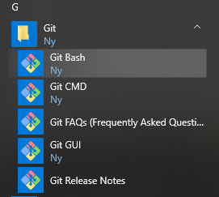


och skriv:

```
git config --global user.email "email@example.com"
```


Detta ställer in e-postadressen i Git, och behövs för att kunna synkronisera filer till GitHub. Naturligtvis ska du ange din egen e-postadress.

Därefter skriver du i terminalfönstret:

```
git config --global user.name "Ditt Namn"
```

Även detta behövs för att synkronisera filer med GitHub; naturligtvis anger du ditt eget namn.

Namn och e-postadress kommer inte att synas någonstans utanför datorn, så ovanstående punkter görs enbart för att det ska gå att synkronisera dina filer.

Du kan kontrollera att informationen sparats genom att i terminalfönstret skriva:

```
git config --list
```

***

### __4. Skapa ett SSH-nyckelpar__
Vi går vidare i konfigurationen genom att skapa ett ssh-nyckelpar. `ssh` står för *Secure SHell*, och används ofta för att logga in på datorer på nätverk. `ssh` används även för att autensiera din behörighet att synkronisera filer på ditt eget GitHub-konto.

I terminalfönstret skriver du nu

```
ssh-keygen
```

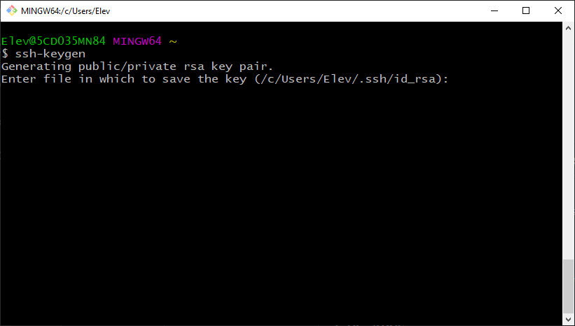

**Tryck \<Enter>**


**Tryck \<Enter>** (Du ska alltså inte sätta ett lösenord; detta för att det blir mer lätthanterligt med VS Code).

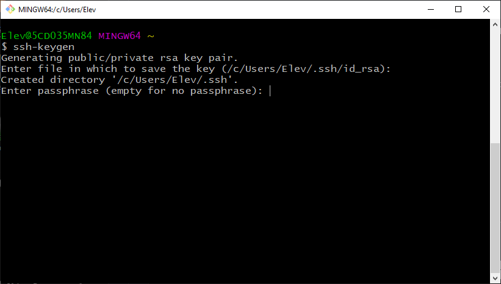

Här ska du bara trycka **\<Enter>** igen.


Nu är nyckelparet skapat och terminalen visar lite information om det.

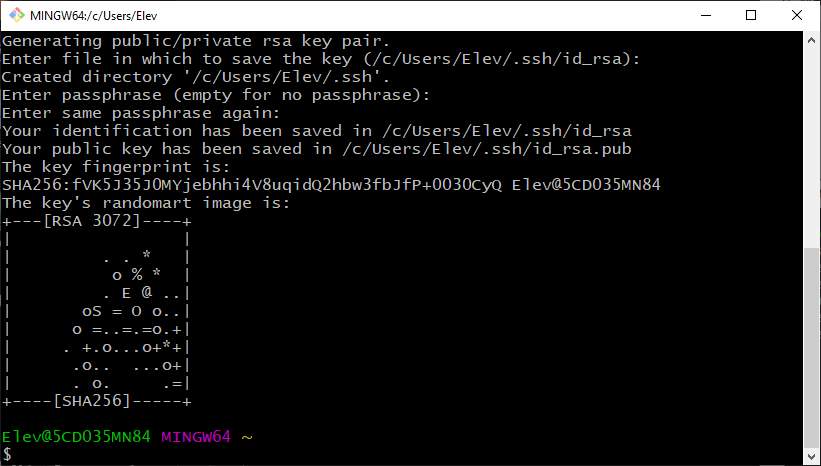

Du kan kontrollera att filerna skapades med kommandot `ls .ssh` i terminalen (observera den inledande punkten). Du kan också titta på den publika nyckeln genom att skriva kommandot

``
cat .ssh/id_rsa.pub
``

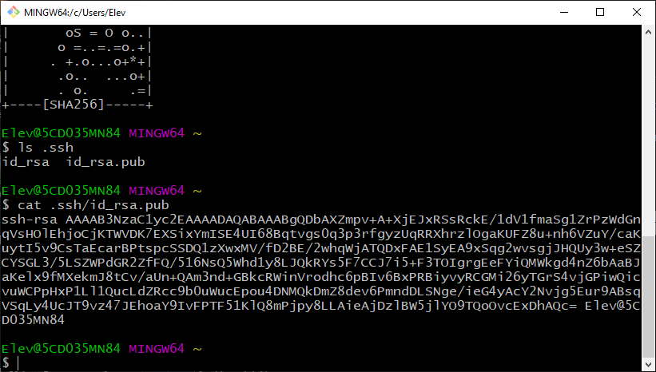

Filerna är nyckelparet; `id_rsa` är den privata delen i paret och ska inte lämna din dator. `id_rsa.pub` är den publika delen och dess innehåll ska kopieras till GitHub (beskrivs i punkt 6 nedan).


Nu är själva skapandet av nyckelparet klart (men vi har en bit kvar att gå, så stäng inte terminalfönstret ännu!).

***


### __5. Ge datorn tillåtelse att upprätta förbindelse med GitHub__
Vi måste ge ssh tillåtelse att ansluta till GitHub. Det görs med kommandot

```
ssh-keyscan.exe -t rsa github.com >> .ssh/known_hosts
```

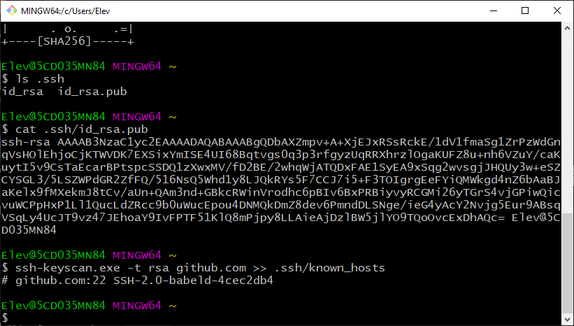

***

### __6. Kopiera den publika delen av nyckelparet__
Nu ska den publika delen av nyckeln kopieras till GitHub. Tidigare visdade du nyckeln i terminalfönstret (har du inte det kvar i fönstret kan du skriva in kommandot `cat .ssh/id_rsa.pub` igen). Markera det innehållet och kopiera (högerklicka efter du markerat för att få upp menyn med möjlighet att kopiera):

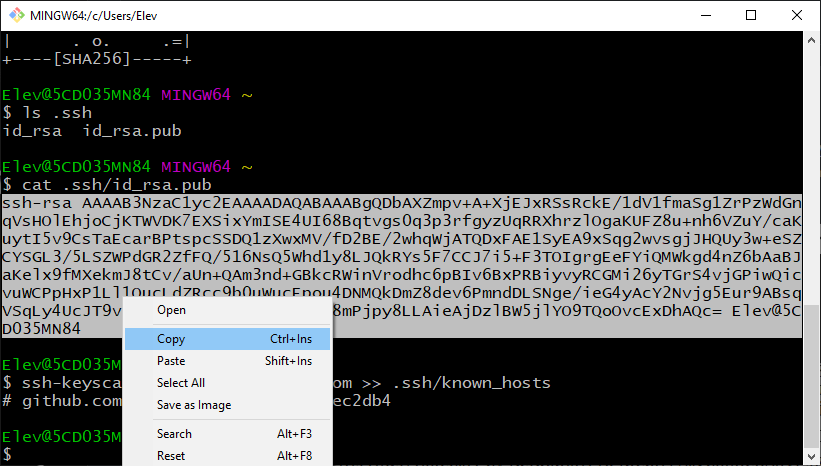

**Tillägg**: Exponera inte din publika nyckel i onödan (och aldrig någonsin din privata nyckel). Själv skapade jag ett nytt nyckelpar efter att jag tagit alla skärmbilder som behövdes.

***

### __7. Installera den publika delen av nyckelparet på GitHub__
Öppna inställningssidan på ditt konto i GitHub:

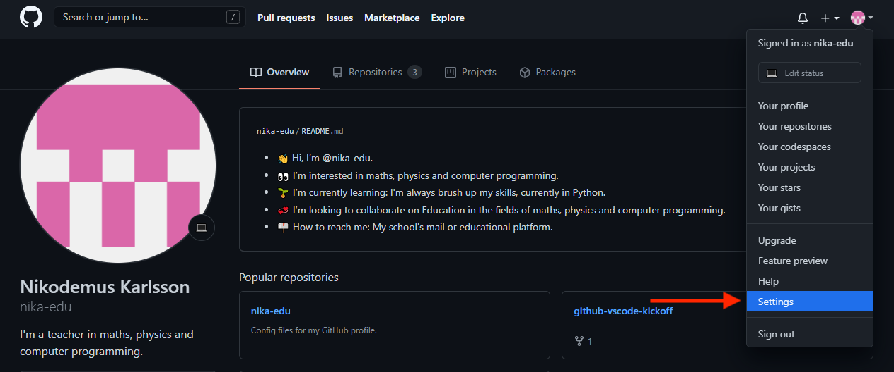

Därefter väljs avdelningen `SSH and GPG keys`, varpå man trycker på knappen `New SSH key`:

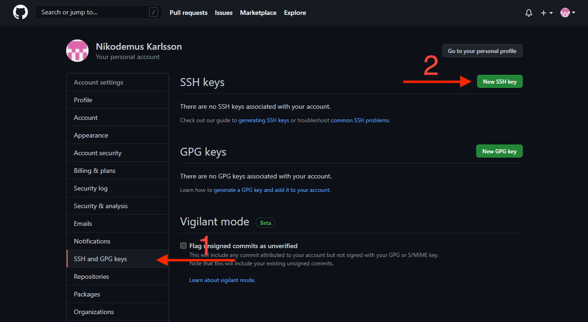

Den publika nyckeln har du kopierat sedan tidigare (punkt 6 ovan), så det bör bara vara att klistra in den. Ge också nyckeln ett namn; själv valde jag det fantasifulla namnet `Default` för min nyckel som jag klistrade in i GitHub.

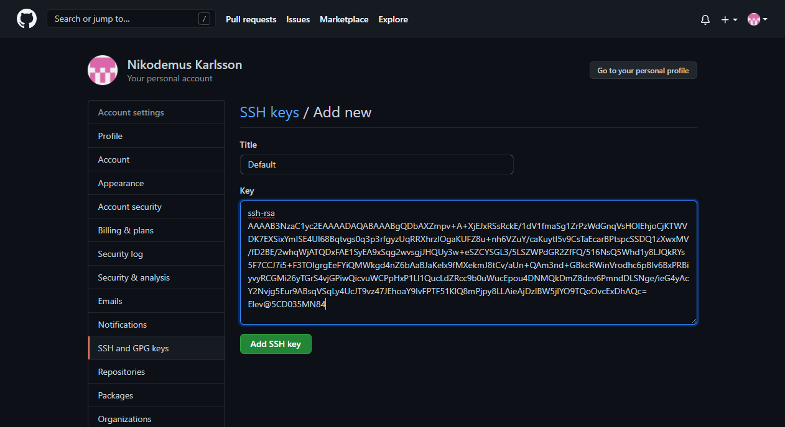

Efter att detta är gjort, och du tryckt på `Add SSH key` under fältet så bör det se ut något liknande som nedan:

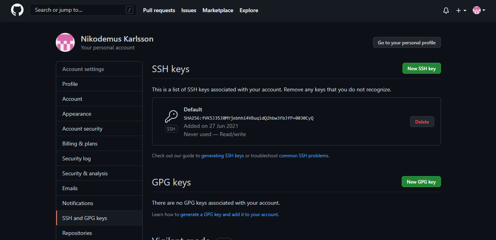

I och med det så är också SSH-konfigurationen av ditt GitHub-konto klar.

***

## Använda VS Code med GitHub
Börja med att [ladda ned](https://code.visualstudio.com/download) och installera VS Code.

VS Code är ett stort program som det dessutom finns massor av tillägg till. Vi fokuserar här på hur det går till att kopiera ett projekt från GitHub till ditt konto, klona detta kopierade projekt till din dator, editera en fil i projektet lokalt på datorn med VS Code, för att slutligen synkronisera filen med GitHub igen. Vi tar dessa saker steg för steg.

1. [Kopiera ett projekt (med `Fork`) till ditt konto](#1-kopiera-ett-projekt-med-fork-till-ditt-konto)
2. [Klona projektet till din dator](#2-klona-projektet-till-din-dator)
3. [Editera och spara](#3-editera-och-spara)
4. [Versionshantering och synkronisering](#4-versionshantering-och-synkronisering)


***

### 1. __Kopiera ett projekt (med Fork) till ditt konto__

Först måste du skapa ett projekt (eller egentligen en *repository*, populärt kallat *repo*, vilket kan översättas med "behållare") på ditt GitHub-konto. Det vi mest kommer att göra i skolan är att kopiera (på GitHub-språk heter detta **Fork**) sådana *repos* (det kommer egentligen enbart att vara s.k kodskelett och beskrivning av uppgifter) som du sedan ska göra något med. [Jag har skapat repon ForkMe](https://github.com/nika-edu/ForkMe) som enbart består av en fil.

ForkMe är ett övningsprojekt som går ut på att du ska kopiera projektet till ditt GitHub-konto ("*Fork:a*" det), därefter *klona* det till din dator, göra några förändringar i en textfil för att slutligen ladda upp det till ditt konto på GitHub igen. Det låter kanske mycket, men när du börjar vänja dig vid proceduren så kommer det att gå allt lättare.

Efter att du gått till länken till *repon* [ForkMe](https://github.com/nika-edu/ForkMe) så finns det en grön knapp upp till höger som det står `Fork` på. Tryck på den. Det som händer är att en kopia av projektet skapas på ditt GitHub-konto (du måste förstås vara inloggad på GitHub). Går du dit så bör det se ut något i stil med nedanstående bild:

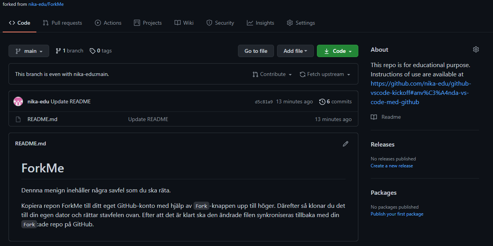

Observera att upptill vänster står det `Forked from nika-edu/ForkMe`, om du ser detta i ditt webbläsarfönster så vet du att du är på rätt plats.

***

### 2. __Klona projektet till din dator__

Nu ska projektet klonas till din dator, det görs genom att du trycker på den gröna knappen som det står `Code` på.

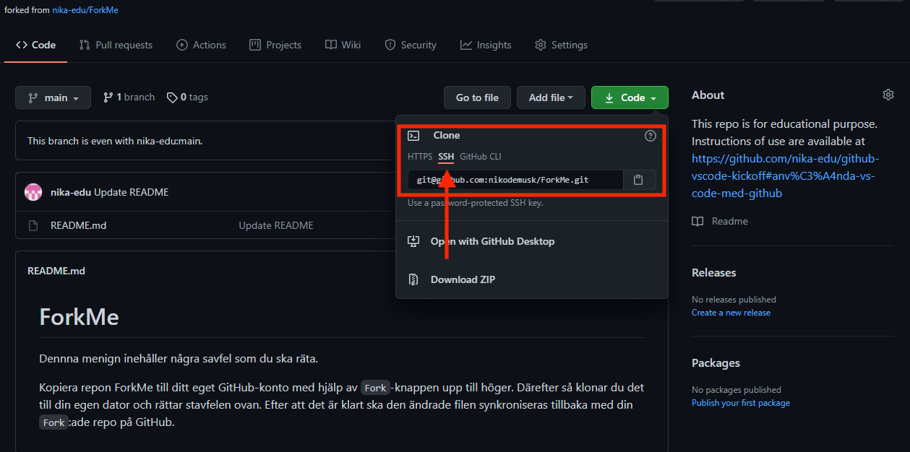

I bilden ovan har jag markerat att du ska trycka där det står SSH. Det betyder att länken kommer att anpassas till att använda SSH (som du ju konfigurerat sedan tidigare). När SSH är valt ska länken i fältet kopieras.

Nu över till VS Code!

När VS Code öppnas i Windows ser det ut något liknande som nedan.

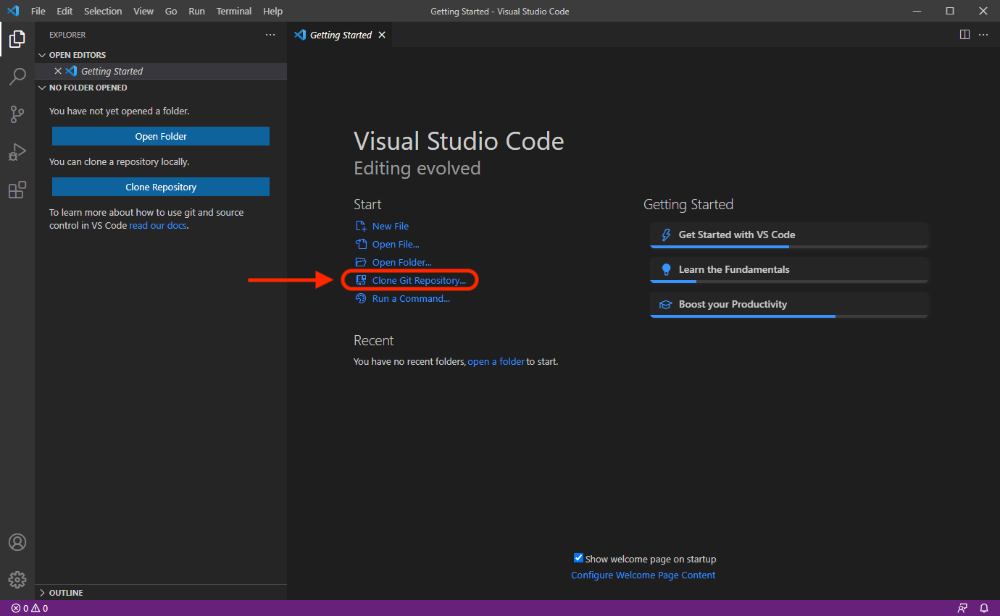

Där ska du trycka på `Clone Git Repository`. I och med att du gör detta så visar sig ett fält i toppen av VS Code:

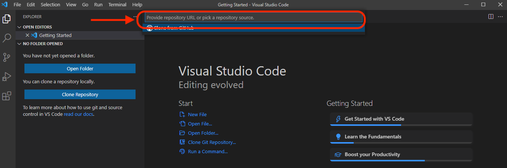

I detta fält klistrar du in länken som du nyss kopierat från GitHGub.

Efter att du klistrat in länken och tryckt på \<Enter> så ska du välja en plats för projektet på din dator. Skapa gärna en katalog / mapp där du samlar de projekt som du arbetar med. Projekten kommer att lägga sig i en undermapp, så du behöver inte själv skapa en egen mapp för respektive projekt. För att snabbt komma åt mappen så kan det vara bra att dra den till fältet för snabbåtkomst i Windows Utforskaren (File Explorer).

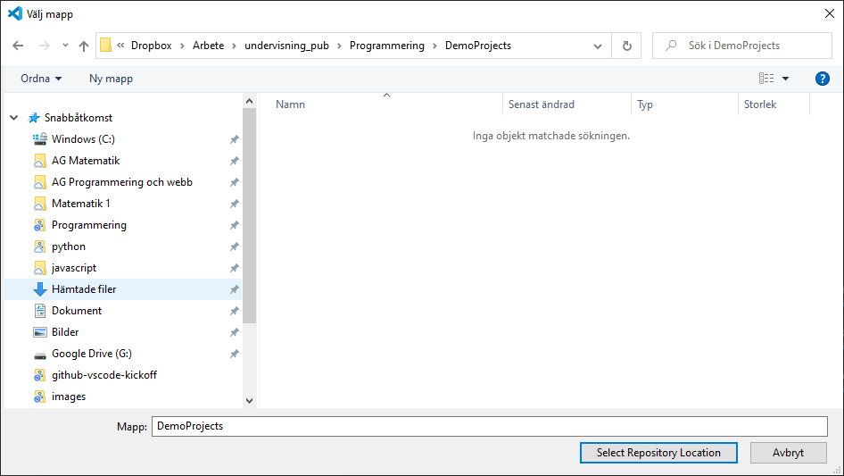

Efter att en plats är bestämd för projektet så kommer det upp en fråga, längst ned till höger, om du vill öppna det i VS Code. Det blir minst stökigt på skrivbordet om det **inte** öppnas i ett nytt fönster.

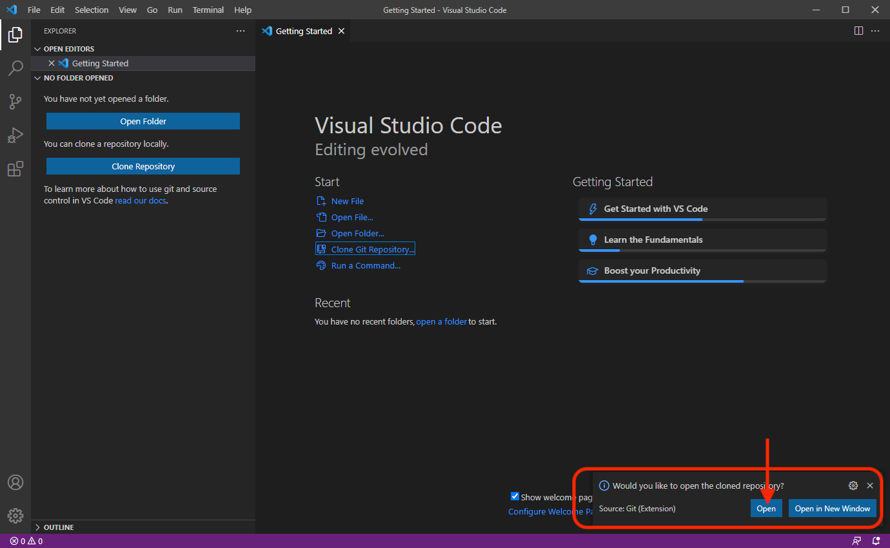

I samband med att projektet öppnas kan det komma upp en fråga om du litar på koden i denna mapp (det bör du göra på din egen dator); det betyder att VS Code i så fall får tillåtelse att köra kod i denna mapp.

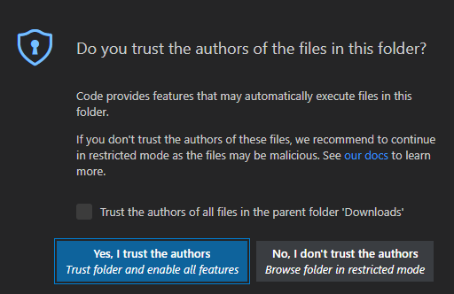

När projektet är öppnat kommer filerna att synas i vänsterkanten. Nu finns filerna (i det här fallet enbart en fil) på din dator, och det är bara att göra vad som ska göras med dem!

***

### 3. __Editera och spara__

Tryck på `README.md`.

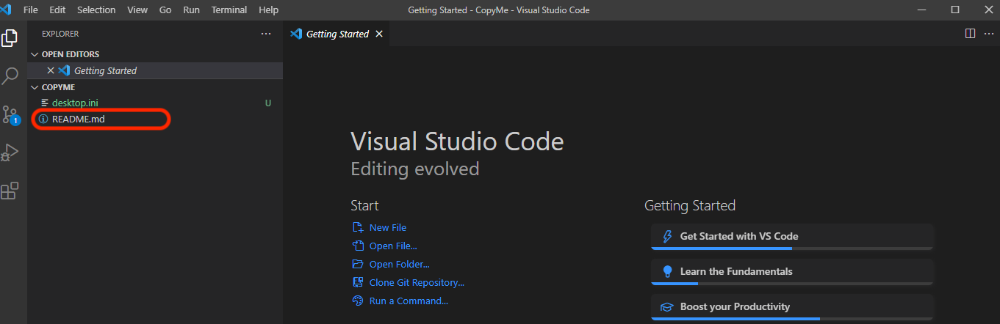

Då kommer filen att visa sig:

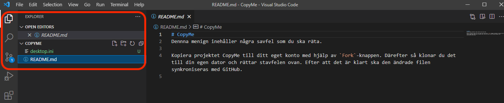

Nu kan du rätta stavfelen i texten:

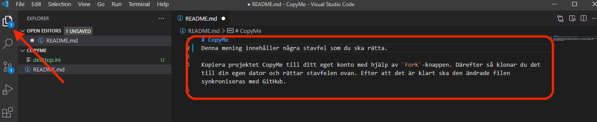

Observera vid pilen att det står en etta. Det betyder att det finns en fil med osparade ändringar. Spara filen, antingen med genom menyalternativet `File -> Save` eller med tangentkombinationen `CTRL+S`. Då försvinner ettan från den platsen.

***

### 4. __Versionshantering och synkronisering__

Versionshantering och synkronisering är en trestegsprocess, vi tar ett steg i taget.

#### <ins>4.1. Göra filen klar för versionshantering (__stage__)</ins>
Gå nu till `Source Control` (pil till vänster nedan):
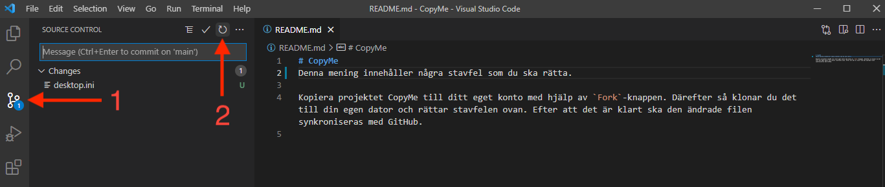

För att uppdatera listan kan VS Code behöva läsa in den på nytt. Det sker genom att trycka på den symbol som pil 2 pekar på i skärmklippet ovan.

I och med att listan uppdaterats så dyker filen upp enligt nedan:

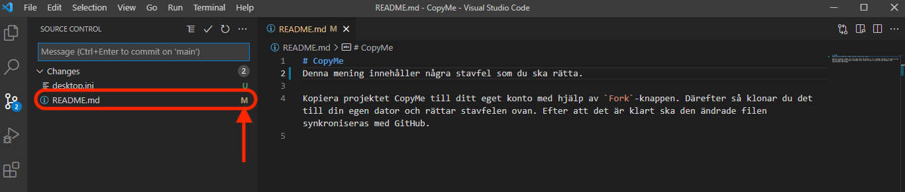

Om du ställer muspekaren på raden i listan så dyker det upp några symboler. Där ska du trycka på plus-tecknet.

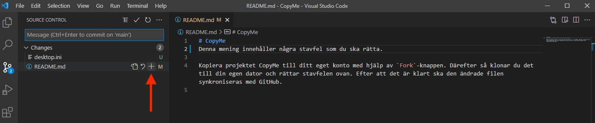

Det som händer nu är att git-systemet förbereder en synkronisering av filen. På engelska heter detta steg **stage** (ungefär etapp på svenska).

#### <ins>4.2. Förbind filen med tidigare versioner (__commit__)</ins>

När filen är "stage:ad" ("iscensatt" på svenska kanske) så ska den "förbindas" med tidigare versioner av filen; detta kallas **commit** på GitHub-språk. I samband med att man gör en **commit** så bör en kort text (*commit message*) av vad som gjordes bifogas också (den kommer att synas i GitHub). Se nedanstående bild:

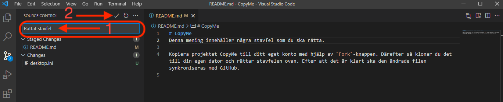

Pilen till vänster visar exempel på text (*commit message*). För att verkställa förbindelsen (*commitment*) så trycker man antingen på den markerade bocken (pil 2) eller så trycker man på CTRL + \<Enter>. Därefter är det enbart ett steg kvar.

#### <ins>4.3. Synkronisering med GitHub (__sync__)</ins>
I det sista steget ska ändringarna synkroniseras med ditt kopierade projekt på GitHub. Nedanstående markering på skärmklippet visar var du ska trycka:

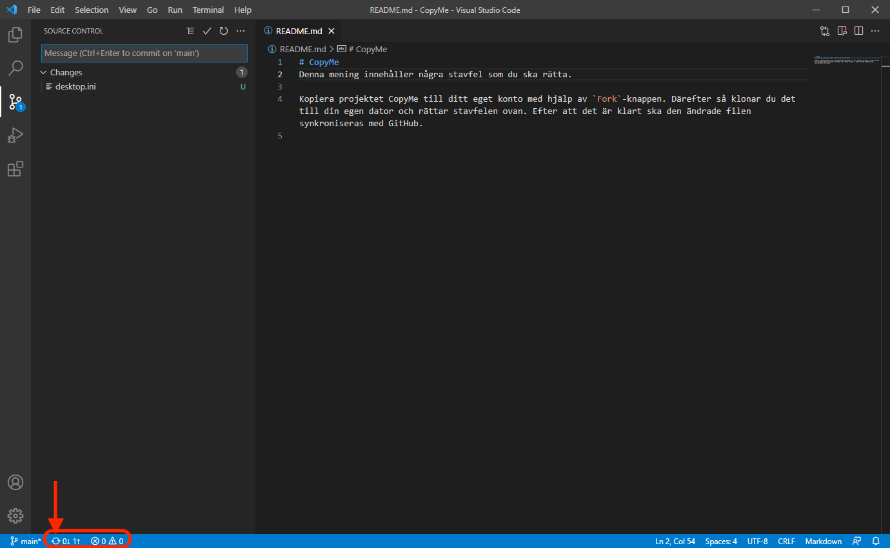

Längst ned till vänster i VS Code ser du pilar som är formade som ett hjul. Det är denna symbol som du ska trycka på för att verkställa synkroniseringen. När "hjulet" har snurrat färdigt är det klart; du har nu en och samma version av projektet på GitHub som på din dator.

***
## __Extra__ - Sätt ett lösenord på din privata nyckel
För att sätta ett lösenord till din privata nyckel ska kommandot 

`ssh-keygen -p`

exekveras i `Git Bash`-terminalen. 

Det som tyvärr är lite bökigt är att VS Code inte verkar ge möjlighet att ange detta lösenord när det behövs. Då får man ta till ett verktyg som heter `ssh-agent`; denna läser in lösenordet till nyckeln och sparar detta i Windows-systemet så länge som datorn är igång. [Följ denna guide](https://github.com/Microsoft/vscode/issues/13680#issuecomment-414841885) för att starta `ssh-agent`. 

När denna är startad kan lösenordet läsas in i agenten. Sök rätt på `PowerShell` på Start-menyn. I `PowerShell` ska sedan kommandot

```
ssh-add
```

exekveras. Nu får du ange lösenordet, och det kommer därefter att sparas i datorns minne. När det är gjort kan du stänga `PowerShell`.

Efter varje omstart av datorn måste du köra `ssh-add`, själva poängen är att lösenordet inte sparas på lagringsmediet. Däremot kommer `ssh-agent` att startas automatiskt om du följde instruktionerna i länken ovan.

**Pro-tips**: Istället för att starta ett separat fönster med `PowerShell` kan det öppnas inuti VS Code. Det kan göras med tangentkombinationen `Ctrl+Shift+Ö`. Väl där inne kan du exekvera kommandot `ssh-add`.
